# ソード・ワールド2.5

* **製作者**: AMT, 甘党料理人
* **対応Sandbox（汎用システム）バージョン**: 0.12.2
* **ワールドバージョン**: 1.0.0

### インストール方法

以下のリンクをワールドとしてインストールしてください。

* リンク： https://raw.githubusercontent.com/BrotherSharper/sw-2.5-sandbox/master/world.json

### クレジット
本作は、「グループＳＮＥ」及び「株式会社ＫＡＤＯＫＡＷＡ」が権利を有する『ソード・ワールド2.0／2.5』の、二次創作です。
(C)GroupSNE
(C)KADOKAWA

### 概要

これはカスタムシステム作成用のシステムであるSandboxを用いて、SW2.5を遊ぶのに必要なキャラクターシートを実装するものです。
使い方はゲーム内の資料一覧にありますが、いかにも転載します。

### PC作成方法と操作説明
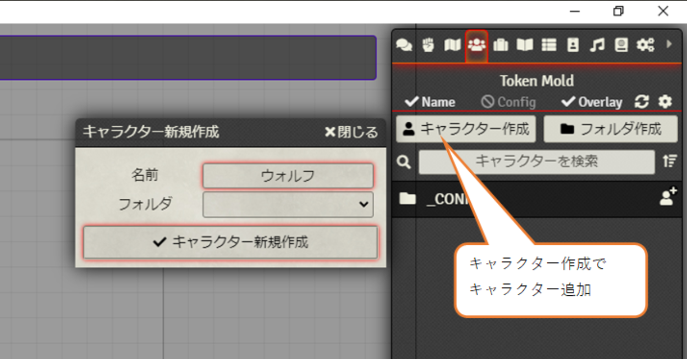  
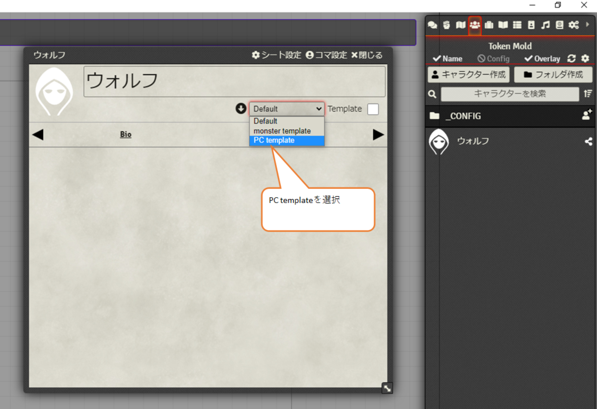  
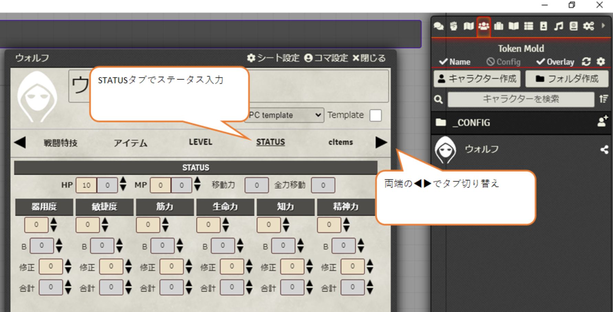  
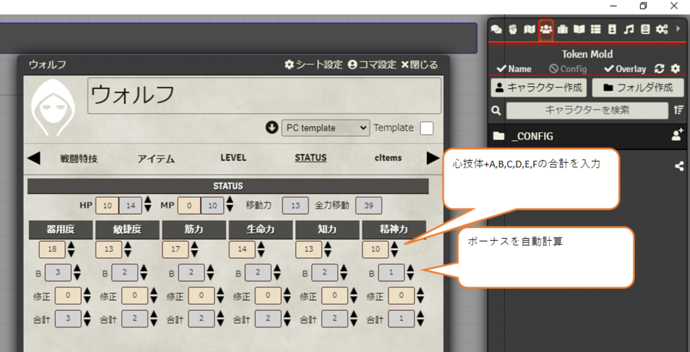  
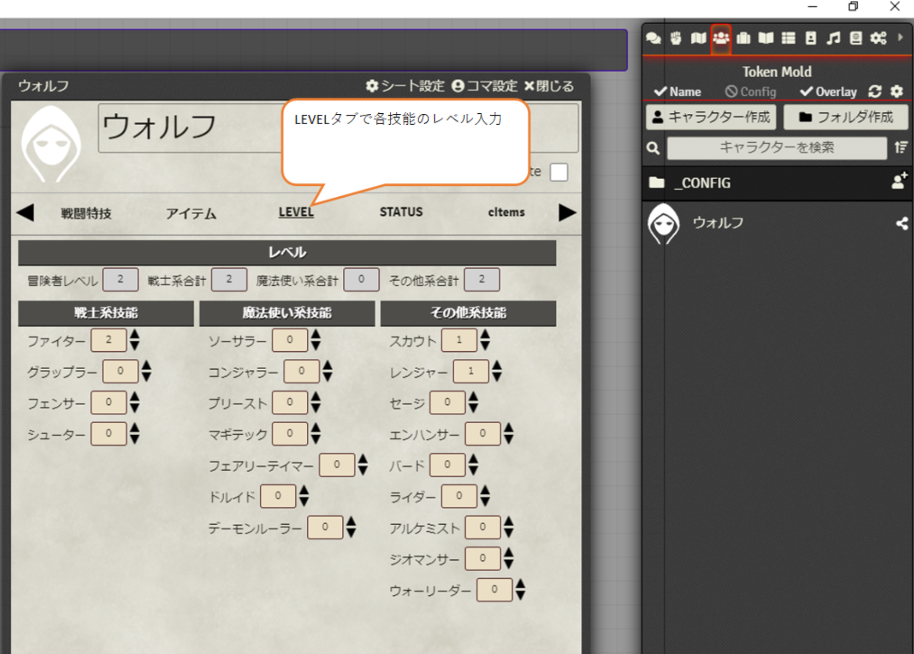  
  
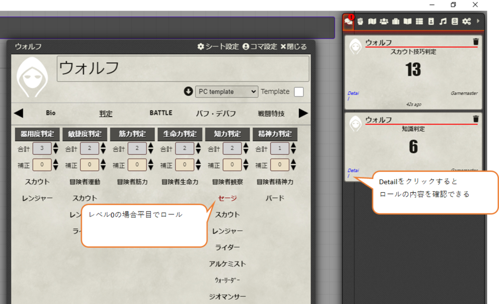  
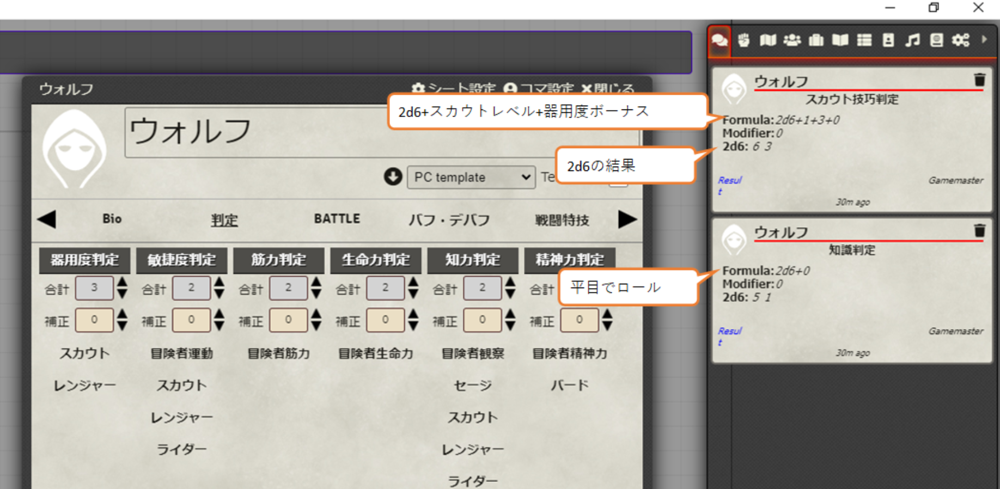  
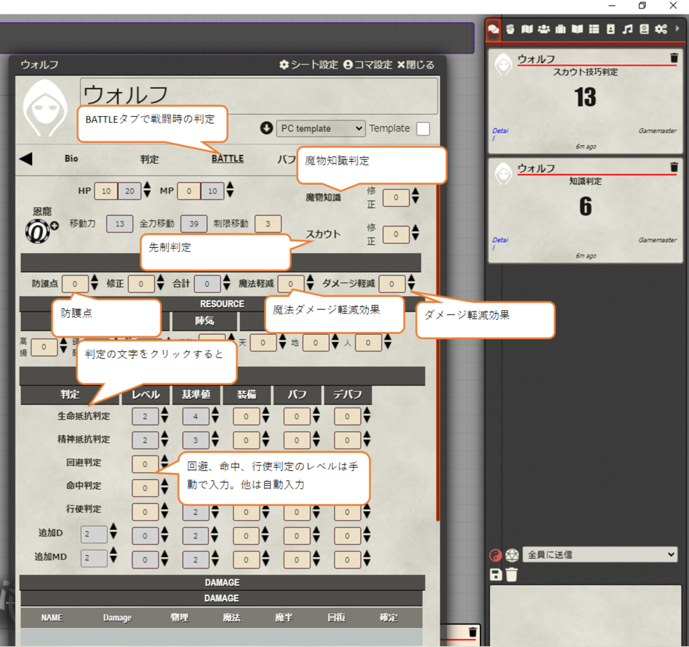  
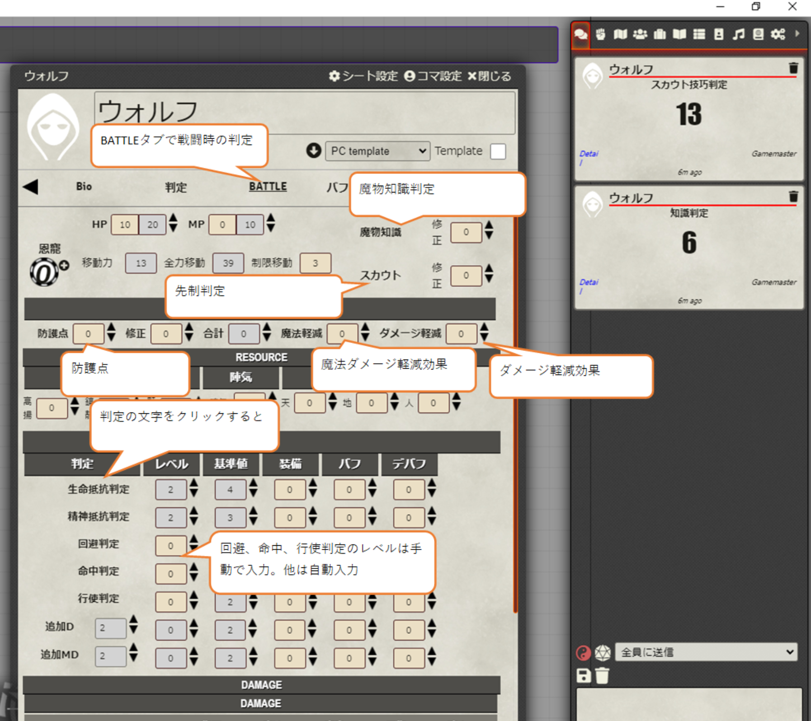  
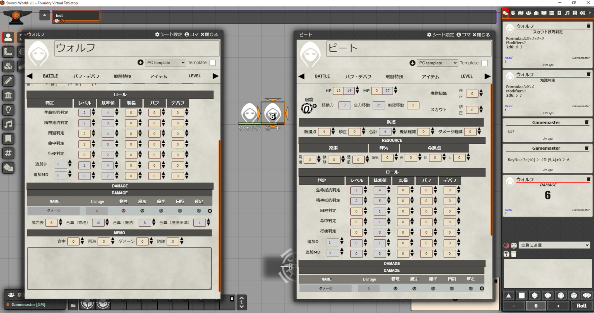  
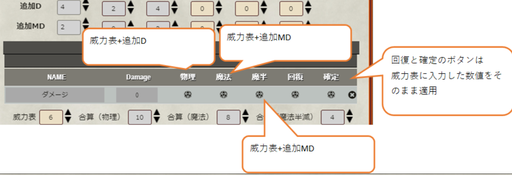  

### モンスターの作成方法と操作説明
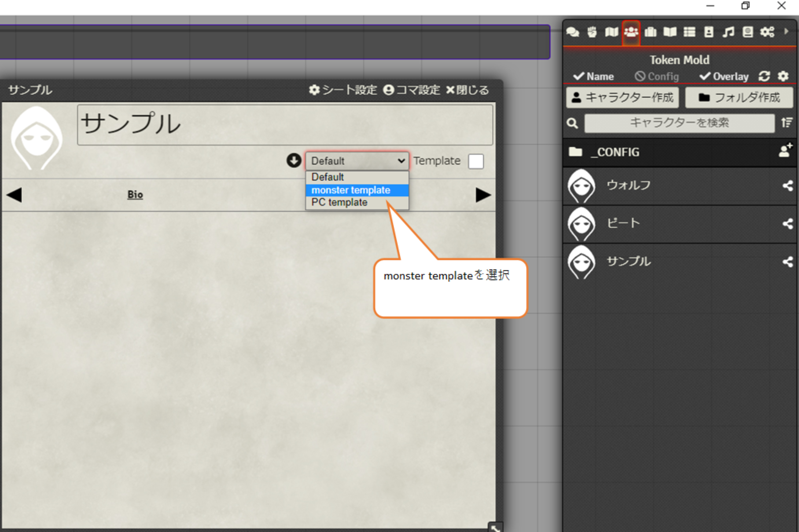  
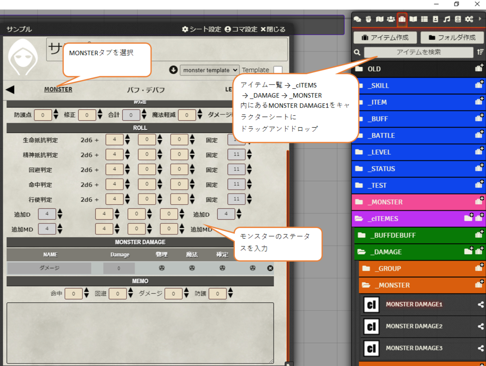  
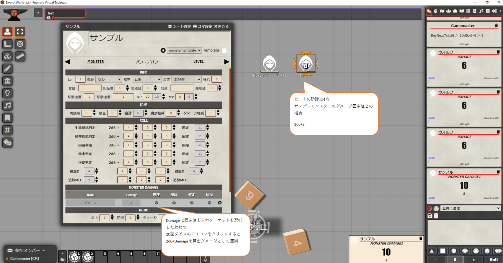  
